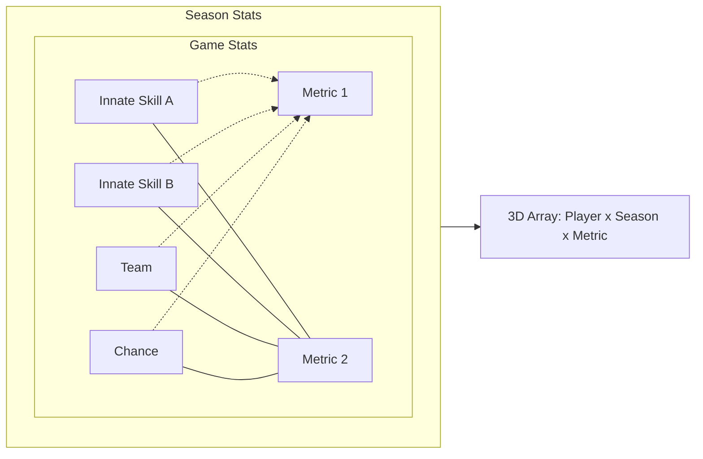

# Meta-Analytics: Tools for Understanding the Statistical Properties of Sports Metrics ∗

Alexander Franks, Alexander D’Amour, Daniel Cervone and Luke Bornn

October 3, 2016

### Abstract

In sports, there is a constant effort to improve metrics which assess player ability, but there has been almost no effort to quantify and compare existing metrics. Any individual making a management, coaching, or gambling decision is quickly overwhelmed with hundreds of statistics. We address this problem by proposing a set of “meta-metrics” which can be used to identify the metrics that provide the most unique, reliable, and useful information for decision-makers. Specifically, we develop methods to evalute metrics based on three criteria: 1) stability: does the metric measure the same thing over time 2) discrimination: does the metric differentiate between players and 3) independence: does the metric provide new information? Our methods are easy to implement and widely applicable so they should be of interest to the broader sports community. We demonstrate our methods in analyses of both NBA and NHL metrics. Our results indicate the most reliable metrics and highlight how they should be used by sports analysts. The meta-metrics also provide useful insights about how to best construct new metrics which provide independent and reliable information about athletes.

∗Alexander M. Franks is a Moore/Sloan Data Science and WRF Innovation in Data Science Postdoctoral Fellow (amfranks@uw.edu). Alexander D’Amour is a Neyman Visiting Assistant Professor in the Department of Statistics at UC Berkeley (alexdamour@berkeley.edu). Daniel Cervone is a Moore-Sloan Data Science Fellow at New York University (dcervone@nyu.edu). Luke Bornn is an Assistant Professor of Statistics at Simon Frasier University. This work was partially supported by the Washington Research Foundation Fund for Innovation in Data-Intensive Discovery, the Moore/Sloan Data Science Environments Project at the University of Washington and New York University, U.S. National Science Foundation grants 1461435, by DARPA under Grant No. FA8750-14-2-0117, by ARO under Grant No. W911NF- 15-1-0172, by Amazon, and by NSERC. The authors are grateful to Andrew Miller (Department of Computer Science, Harvard University), and Kirk Goldsberry for sharing data and ideas which contributed to framing of this paper.

# 1 Introduction

In sports, as in many other industries and research fields, data analysis has become an essential ingredient of management. Sports teams, traditionally run by people with experience playing and/or coaching, now rely heavily on statistical models to measure player ability and inform strategy decisions (Lewis, 2004; Oliver, 2004). Over the years, the quantity, scope, and sophistication of these models has expanded, reflecting new data sources, methodological developments, and increasing interest in the field of sports analytics. Despite their inherent promise, new developments in sports analytics have created a clutter of metrics. For example, there are at least three different calculations of the WAR (“Wins Above Replacement”) metric in baseball (Baumer et al., 2015), all of which have the same hypothetical estimand. In general, any individual making a management, coaching, or gambling decision has potentially dozens of metrics at his/her disposal, but finding the right metrics to support a given decision can be daunting. We seek to ameliorate this problem by proposing a set of “meta-metrics” that describe which metrics provide the most unique and reliable information for decision-makers. Our methods are simple to implement and applicable to any sport so they should be of broad interest to the sports analytics community.

The core idea of our work is that quantifying sources of variability—and how these sources are related across metrics, players, and time—is essential for understanding how sports metrics can be used. In this paper, we consider three different sources of variation, which we classify differently depending on the use-case. These are 1) intrinsic player skill, 2) context, e.g. influence of teammates, and 3) chance, i.e. sampling variability. Each of these sources can vary across seasons and between players. We consider each player metric to be composed of a combination of these sources of variation (Figure 1), and in this paper we discuss several diagnostics that can be used to assess how well certain metrics are able to measure, control for, and average across these sources of variation, depending on what is required by the decision-maker.

The primary purpose of constructing our meta-metrics is to categorize the sources of variation in the data as *signal* and *noise*. The signal corresponds to variation that is the key

input into a decision process, e.g., a player’s ability to operate in a given system, whereas the *noise* is variation that we choose not to explain either because of complexity or lack of information (e.g., complex team interactions or minuscule variations in a player’s release between shots). When relevant we condition on observed contextual information (e.g. player position) to create more reliable and interpretable signals.

For a metric to be useful for a particular decision, its treatment of variation needs to match up with the decision that is being made. For example, consider two distinct tasks in which metrics are often deployed – attribution, where we wish to credit a portion of a team’s success to a given player for, e.g., year-end awards, and acquisition, where we wish to assess whether a player should be added to or retained on a team. The classification of signal and noise in these decision tasks is very different. For attribution, we do not care whether a player can repeat their performance in another season (or arguably even how much of their performance was due to chance), whereas repeatability is a central question in player acquisition. That is, chance and team context are still relevant signals when making an attribution decision, but are sources of noise for an acquisition decision.

While we can isolate some player-wise, season-wise, and team-wise variation by subsetting the data, all measurements that we take are confounded with chance. Further “skills” are abstract concepts that are often collapsed together. With this in mind, we define three meta-metrics that can be used to answer the following questions of player performance metrics:

* **Discrimination**: Does the metric reliably differentiate between players?

* **Stability**: Does the metric measure a quantity which is stable over time?

* **Independence**: Does the metric provide new information?

Our discrimination meta-metric quantifies how useful a metric is for distinguishing between players within a given season, whereas our stability meta-metric measures how much a metric varies season to season due to changes in context and player skill after removing chance variation. The independence meta-metric quantifies how much information in one metric is already captured by a set of other metrics. Our meta-metrics are based on ideas

which have a long history in statistics (e.g., analysis of variance) and psychometrics (e.g., Cronbach’s alpha) (Fisher, 1925; Cronbach, 1951; Kuder and Richardson, 1937) but have not received widespread treatment in sports. The limited work quantifying the reliability of metrics in sports mostly appears in blogs (Sprigings, 2014; Blackport, 2014; Arthur, 2015) and our hope is to formalize and generalize some of the ideas discussed in these these articles. We start, in Section 2 by motivating and defining three meta-metrics and discuss how to estimate them in Section 3. Section 4 demonstrates the application of these meta-metrics to player performance in National Basketball Association (NBA) and National Hockey League (NHL). Lastly, in Section 5 we discuss building new metrics and adjusting existing ones in order to improve their meta-analytic properties.

Figure 1: Sources of variation in end-of-season metrics. Player metrics confound different aspects of intrinsic player style or ability, team effects and chance (e.g. sampling variability). We visualize metrics amongst multiple players across seasons in a 3-dimensional array (right). Here, we illustrate two hypothetical metrics, one in red and another purple. Variation in the color’s tone on the front face corresponds to observed between-player variability in a single season and variation on the right face corresponds to variability in the metric for one player over time. Team-wise and chance variation also play a role in determining the variation in color tone.

# 2 Defining Meta-metrics

Throughout this paper, we write the 3-dimensional array of players, seasons and metrics as $X$, with $X_{spm}$ the value of metric $m$ for player $p$ from season $s$ (see Figure 1). Our meta-metrics are all R-squared style statistics and can be understood as functions of the (co)variances along the three dimensions of $X$. As a useful example, consider a model for a metric $m$ that varies over time $s$ and between players $p$ is a linear mixed effects model:

$$X_{spm} = \mu_m + Z_{sm} + Z_{pm} + Z_{spm} + \epsilon_{spm}, \tag{1}$$

where

$$
\begin{aligned}
Z_{sm} &\sim [0, \sigma^2_{\text{SM}}] \\
Z_{pm} &\sim [0, \sigma^2_{\text{PM}}] \\
Z_{spm} &\sim [0, \sigma^2_{\text{SPM}}] \\
\epsilon_{spm} &\sim [0, \tau^2_{\text{M}}],
\end{aligned}
$$

and $[\mu, \sigma^2]$ represents a distribution with mean $\mu$ and variance $\sigma^2$. The terms $Z_*$ can be thought of as random effects, while $\epsilon_{spm}$ represents individual player-season variation in a metric—for instance, binomial variation in made shot percentage given a finite sample size. $Z_{spm}$ and $\epsilon_{spm}$ are distinguished by assuming that for an infinitely long season, a player’s metric would have no such variability, thus $\epsilon_{spm} = 0$. Note that we can recognize $\sigma^2_{\text{PM}} + \sigma^2_{\text{SPM}} + \tau^2_{\text{M}}$ as the within-season, between-player variance; $\sigma^2_{\text{SM}} + \sigma^2_{\text{SPM}} + \tau^2_{\text{M}}$ as the within-player, beween-season variance; and of course, $\sigma^2_{\text{SM}} + \sigma^2_{\text{PM}} + \sigma^2_{\text{SPM}} + \tau^2_{\text{M}}$ as the total (between player-season) variance. Both the discrimination and stability meta-metrics defined in this section can be expressed as ratios involving these quantities, along with the sampling variance $\tau^2_{\text{M}}$.

The linear mixed effects model (1) may be a reasonable choice for some metrics and, due to its simplicity, provides a convenient example to illustrate our meta-metrics. However, an exchangeable, additive model is not appropriate for many of the metrics we consider. A major practical challenge in our analysis is that all of the metrics have unique distributions

with distinct support—percentages are constrained to the unit interval, while many per game or per season statistics are discrete and strictly positive. Other advanced metrics like “plus-minus” or “value over replacement” (VORP) in basketball are continuous real-valued metrics which can be negative or positive.

To define meta-metrics with full generality, consider the random variable $X$, which is a single entry $X_{spm}$ chosen randomly from $X$. Randomness in $X$ thus occurs both from sampling the indexes $S$, $P$, and $M$ of $X$, as well as intrinsic variability in $X_{spm}$ due to finite season lengths. We will then use the notational shorthand

$$E_{spm}[X] = E[X|S = s, P = p, M = m]$$
$$V_{spm}[X] = Var[X|S = s, P = p, M = m]$$

and analogously for $E_{sm}[X], V_{sm}[X], E_m[X]$, etc. For example, $E_{sm}[V_{spm}[X]]$ is the average over all players of the intrinsic variability in $X_{spm}$ for metric $m$ during season $s$, or $\sum_p Var[X_{spm}]/N_{sm}$, where $N_{sm}$ is the number of entries of $X_{s \cdot m}$.

## 2.1 Discrimination

For a metric measuring player ability to be applicable, it must be a useful tool for discriminating between different players. Implicit in this is that most of the variability between players reflects true variation in player ability and not chance variation or noise from small sample sizes. As a useful baseline for discrimination, we compare the average intrinsic variability of a metric to the total between player variation in this metric. A similar approach which partially inspired this metric was used to compare how reliably one could differentiate MVP candidates in Major League Baseball (Arthur, 2015).

To characterize the discriminative power of a metric, we need to quantify the fraction of total between player variance that is due to chance and the fraction that is due to signal. By the law of total variance, this can be decomposed as

$$V_{sm}[X] = E_{sm}[V_{spm}[X]] + V_{sm}[E_{spm}[X]].$$

Here, $V_{sm}[X]$ corresponds to the total variation in metric $m$ between players in season $s$, whereas $E_{sm}[V_{spm}[X]]$ is the average (across players) sampling variability for metric $m$ in season $s$. With this decomposition in mind, we define the discriminative power of a metric $m$ in season $s$ as

$$ (\text{Discrimination}) \quad \mathcal{D}_{sm} = 1 - \frac{E_{sm}[V_{spm}[X]]}{V_{sm}[X]}. \tag{2} $$

Intuitively, this describes the fraction (between 0 and 1) of between-player variance in $m$ (in season $s$) due to true differences in player ability. Discrimination meta-metrics for different seasons can be combined as $\mathcal{D}_m = E_m[\mathcal{D}_{sm}]$.

It is helpful to understand the discrimination estimand for the linear mixed effects model defined in Equation 1. When this model holds, $E_{sm}[V_{spm}[X]] = \tau_M^2$, and $V_{sm}[X] = \sigma_{PM}^2 + \sigma_{SPM}^2 + \tau_M^2$, the between-player variance (equal for all seasons $s$). Thus, the discrimination meta-metric under the linear mixed effects model is simply

$$ \begin{aligned} \mathcal{D}_m &= 1 - \frac{\tau_M^2}{\sigma_{PM}^2 + \sigma_{SPM}^2 + \tau_M^2} \\ &= \frac{\sigma_{PM}^2 + \sigma_{SPM}^2}{\sigma_{PM}^2 + \sigma_{SPM}^2 + \tau_M^2}. \end{aligned} \tag{3} $$

## 2.2 Stability

In addition to discrimination, which is a meta-metric that describes variation within a single season, it is important to understand how much an individual player’s metric varies from season to season. The notion of stability is particularly important in sports management when making decisions about about future acquisitions. For a stable metric, we have more confidence that this year’s performance will be predictive of next year’s performance. A metric can be unstable if it is particularly context dependent (e.g. the player’s performance varies significantly depending on who their teammates are) or if a players’ intrinsic skill set tends to change year to year (e.g. through offseason practice or injury).

Consequently, we define stability as a metric, which describes how much we expect a single player metric to vary over time after removing chance variability. This metric specifically targets the sensitivity of a metric to change in context or intrinsic player skill over time.

Mathematically, we define *stability* as:

$$ (\text{Stability}) \quad \mathcal{S}_m = 1 - \frac{E_m[V_{pm}[X] - V_{spm}[X]]}{V_m[X] - E_m[V_{spm}[X]]}, \eqno(4) $$

with $0 \leq \mathcal{S}_m \leq 1$ (see Appendix for proof). Here, $V_{pm}[X]$ is the between-season variability in metric $m$ for player $p$; thus, the numerator in (4) averages the between-season variability in metric $m$, minus sampling variance, over all players. The denominator is the total variation for metric $m$ minus sampling variance. Again, this metric can be easily understood under the assumption of an exchangeable linear model (Equation 1).:

$$ \begin{aligned} \mathcal{S}_m &= 1 - \frac{\sigma^2_{\text{SM}} + \sigma^2_{\text{SPM}} + \tau^2_{\text{M}} - \tau^2_{\text{M}}}{\sigma^2_{\text{PM}} + \sigma^2_{\text{SM}} + \sigma^2_{\text{SPM}} + \tau^2_{\text{M}} - \tau^2_{\text{M}}} \\ &= \frac{\sigma^2_{\text{PM}}}{\sigma^2_{\text{PM}} + \sigma^2_{\text{SM}} + \sigma^2_{\text{SPM}}}. \end{aligned} \eqno(5) $$

This estimand reflects the fraction of total variance (with sampling variability removed) that is due to within-player changes over time. If the within player variance is as large as the total variance, then $\mathcal{S}_m = 0$ whereas if a metric is constant over time, then $\mathcal{S}_m = 1$.

## 2.3 Independence

When multiple metrics measure similar aspects of a player’s ability, we should not treat these metrics as independent pieces of information. This is especially important for decision makers in sports management who use these metrics to inform decisions. Accurate assessments of player ability can only be achieved by appropriately synthesizing the available information. As such, we present a method for quantifying the dependencies between metrics that can help decision makers make sense of the growing number of data summaries.

For some advanced metrics we know their exact formula in terms of basic box score statistics, but this is not always the case. For instance, it is much more challenging to assess the relationships between new and complex model based NBA metrics like adjusted plus minus (Sill, 2010), EPV-Added (Cervone et al., 2014) and counterpoints (Franks et al., 2015), which are model-based metrics that incorporate both game-log and player tracking data. Most importantly, as illustrated in Figure 1, even basic box score statistics that are

not functionally related will be correlated if they measure similar aspects of intrinsic player skill (e.g., blocks and rebounds in basketball are highly correlated due to their association with height).

As such, we present a general approach for expressing dependencies among an arbitrary set of metrics measuring multiple players’ styles and abilities across multiple seasons. Specifically, we propose a Gaussian copula model in which the dependencies between metrics are expressed with a latent multivariate normal distribution. Assuming we have $M$ metrics of interest, let $Z_{sp}$ be an $M$-vector of metrics for player $p$ during season $s$, and

$$Z_{sp} \overset{iid}{\sim} \text{MVN}(0, C) \tag{6}$$

$$X_{spm} = F_m^{-1}[\Phi(Z_{spm})], \tag{7}$$

where $C$ is a $M \times M$ correlation matrix, and $F_m^{-1}$ is the inverse of the CDF for metric $m$. We define independence score of a metric $m$ given a condition set of other metrics, $\mathcal{M}$, as

$$\mathcal{I}_{m\mathcal{M}} = \frac{Var[Z_{spm} \mid \{Z_{spq} : q \in \mathcal{M}\}]}{Var[Z_{spm}]} = C_{m,m} - C_{m,\mathcal{M}}C_{\mathcal{M},\mathcal{M}}^{-1}C_{\mathcal{M},m}. \tag{8}$$

For the latent variables $Z$, this corresponds to one minus the R-squared for the regression of $Z_m$ on the latent variables $Z_q$ with $q$ in $\mathcal{M}$. Metrics for which $\mathcal{I}_{m\mathcal{M}}$ is small (e.g. for which the R-squared is large) provide little new information relative to the information in the set of metrics $\mathcal{M}$. In contrast, when $\mathcal{I}_{m\mathcal{M}}$ is large, the metric is nearly independent from the information contained in $\mathcal{M}$. Note that $\mathcal{I}_{m\mathcal{M}} = 1$ implies that metric $m$ is independent from all metrics in $\mathcal{M}$.

We also run a principal component analysis (PCA) on $C$ to evaluate the amount of independent information in a set of metrics. If $U\Lambda U^T$ is the eigendecomposition of $C$, with $\Lambda = \text{diag}(\lambda_1, ...\lambda_M)$ the diagonal matrix of eigenvalues, then we can interpret $\mathcal{F}_k = \frac{\sum_1^k \lambda_i}{\sum_1^M \lambda_i}$ as the fraction of total variance explained by the first $k$ principal components (Mardia et al., 1980). When $\mathcal{F}_k$ is large for small $k$ then there is significant redundancy in the set of metrics, and thus dimension reduction is possible.

# 3 Inference

In order to calculate discrimination $\mathcal{D}_m$ and stability $\mathcal{S}_m$, we need estimates of $V_{spm}[X]$, $V_{sm}[X]$, $V_{pm}[X]$ and $V_m[X]$. Rather than establish a parametric model for each metric (e.g. the linear mixed effects model (1)), we use nonparametric methods to estimate reliability. Specifically, to estimate the sampling distribution of $X$ within each season (e.g., $Var[X_{spm}]$, or equivalently $V_{spm}[X]$, for all $s, p, m$), we use the bootstrap (Efron and Tibshirani, 1986). For each team, we resample (with replacement) every game played in a season and reconstruct end-of-season metrics for each player. We use the sample variance of these resampled metrics, $\text{BV}[X_{spm}]$, to estimate the intrinsic variation in each player-season metric $X_{spm}$. We estimate $V_{sm}[X]$, $V_{pm}[X]$ and $V_m[X]$ using sample moments.

Thus, assuming $P$ players, our estimator for discrimination is simply

$$ \hat{\mathcal{D}}_{sm} = 1 - \frac{\frac{1}{P} \sum_{p=1}^P \text{BV}[X_{spm}]}{\frac{1}{P} \sum_{p=1}^P (X_{spm} - \bar{X}_{s \cdot m})^2} $$

where $\bar{X}_{s \cdot m}$ is the average of metric $m$ over the players in season $s$. Similarly, the stability estimator for a metric $m$ is

$$ \hat{\mathcal{S}}_m = 1 - \frac{\frac{1}{P} \sum_{p=1}^P \frac{1}{S_p} \sum_{s=1}^{S_p} \left[ (X_{spm} - \bar{X}_{\cdot pm})^2 - \text{BV}[X_{spm}] \right]}{\frac{1}{P} \sum_{p=1}^P \frac{1}{S} \sum_{p=1}^{S_p} \left[ (X_{spm} - \bar{X}_{\cdot \cdot m})^2 - \text{BV}[X_{spm}] \right]} $$

where $\bar{X}_{\cdot pm}$ is the mean of metric $m$ for player $p$ over all seasons, $\bar{X}_{\cdot \cdot m}$ is the total mean over all player-seasons, and $S_p$ is the number of seasons played by player $p$.

All independence meta-metrics are defined as a function of the latent correlation matrix $C$ from the copula model presented in Equation 6. To estimate $C$, we use the semi-parametric rank-likelihood approach developed by Hoff (2007). This method is appealing because we eschew the need to directly estimate the marginal density of the metrics, $F_m$. We fit the model using the R package *sbgcop* (Hoff, 2012). Using this software, we can model the dependencies for both continous and discrete valued metrics with missing values.

In Section 4, we use $\mathcal{I}_{m \mathcal{M}}$ to generate "independence curves" for different metrics as a function of the number of statistics in the conditioning set, $\mathcal{M}$. To create these curves, we use a greedy approach: for each metric $m$ we first estimate the independence score $\mathcal{I}_{m \mathcal{M}}$

(Equation 8) conditional on the full set of available metrics $\mathcal{M}$, and then iteratively remove metrics that lead to the largest increase in independence score (See Algorithm 1).

**Algorithm 1** Create independence curves for metric $m$
***

1: $\text{IC}_m \leftarrow \text{Vector}(|\mathcal{M}|)$
2: $\mathcal{M}^* \leftarrow \mathcal{M}$
3: **for** $i = |\mathcal{M}|$ to 1 **do**
4: $\quad \mathcal{I}_{max} \leftarrow 0$
5: $\quad m_{max} \leftarrow \text{NA}$
6: $\quad$ **for** $\tilde{m} \in \mathcal{M}^*$ **do**
7: $\quad \quad \mathcal{G} \leftarrow \mathcal{M}^* \setminus \{\tilde{m}\}$
8: $\quad \quad$ **if** $\mathcal{I}_{m\mathcal{G}} > \mathcal{I}_{max}$ **then**
9: $\quad \quad \quad \mathcal{I}_{max} \leftarrow \mathcal{I}_{m\mathcal{G}}$
10: $\quad \quad \quad m_{max} \leftarrow \tilde{m}$
11: $\quad \quad$ **end if**
12: $\quad$ **end for**
13: $\quad \mathcal{M}^* \leftarrow \mathcal{M}^* \setminus m_{max}$
14: $\quad \text{IC}_m[i] \leftarrow \mathcal{I}_{m\mathcal{M}^*}$
15: **end for**
16: **return** $\text{IC}_m$
***

# 4 Results

To demonstrate the utility of our meta-metrics, we analyze metrics from both basketball (NBA) and hockey (NHL), including both traditional and "advanced" (model-derived) metrics. We gathered data on 70 NBA metrics from all players and seasons from the year 2000 onwards (Sports Reference LLC, 2016a). We also gather 40 NHL metrics recorded from the year 2000 onwards (Sports Reference LLC, 2016b). Where appropriate, we normalized metrics by minutes played or possessions played to ameliorate the impact of anomalous events in our data range, such as injuries and work stoppages; this approach sacrifices no generality, since minutes/possessions can also be treated as metrics. In the appendix we provide a glossary of all of the metrics evaluated in this paper.

# 4.1 Analysis of NBA Metrics

In Figure 2 we plot the stability and discrimination meta-metrics for many of the NBA metrics available on [basketball-reference.com](basketball-reference.com). For basic box score statistics, discrimination and stability scores match intuition. Metrics like rebounds, blocks and assists, which are strong indicators of player position, are highly discriminative and stable because of the relatively large between player variance. As another example, free throw percentage is a relatively non-discriminative statistic within-season but very stable over time. This makes sense because free throw shooting requires little athleticism (e.g., does not change with age or health) and is isolated from larger team strategy and personnel (e.g., teammates do not have an effect on a player’s free throw ability).

Our results also highlight the distinction between pure rate statistics (e.g., per-game or per-minute metrics) and those that incorporate total playing time. Metrics based on total minutes played are highly discriminative but less stable, whereas per-minute or per-game metrics are less discriminative but more stable. One reason for this is that injuries affect total minutes or games played in a season, but generally have less effect on per-game or per-minute metrics. This is an important observation when comparing the most reliable metrics since it is more meaningful to compare metrics of a similar type (rate-based vs total).

WS/48, ORtg, DRtg and BPM metrics are rate-based metrics whereas WS and VORP based metrics incorporate total minutes played (Sports Reference LLC, 2016a). WS and VORP are more reliable than the rate based statistics primarily because MP significantly increases their reliability, *not* because there is stronger signal about player ability. Rate based metrics are more relevant for estimating player skill whereas total metrics are more relevant for identifying overall end of season contributions (e.g. for deciding the MVP). Since these classes of metrics serve different purposes, in general they should not be compared directly. Our results show moderately improved stability and discriminative power of the BPM-based metrics over other rate-based metrics like WS/48, ORTg and DRtg. Similarly, we can see that for the omnibus metrics which incorporate total minutes played, VORP is more reliable in both dimensions than total WS.

Perhaps the most striking result is the unreliability of empirical three point percentage. It is both the least stable and least discriminative of the metrics that we evaluate. Amazingly, over 50% of the variation in three point percentage between players in a given season is due to chance. This is likely because differences between shooters’ true three point shooting percentage tend to be very small, and as such, chance variation tends to be the dominant source of variation. Moreover, contextual variation like a team’s ability to create open shots for a player affect the stability of three point percentage.

Finally, we use independence meta-metrics to explore the dependencies between available NBA metrics. In Figure 3 we plot the independence curves described in Section 3. Of the metrics that we examine, steals (STL) appear to provide some of the most unique information. This is evidenced by the fact that the $\mathcal{I}_{\mathcal{M}}^{STL} \approx 0.40$ , meaning that only 60% of the variation in steals across player-seasons is explainable by the other 69 metrics. Moreover, the independence score estimate increases quickly as we reduce the size of the conditioning set, which highlights the relative lack of metrics that measure skills that correlate with steals. While the independence curves for defensive metrics are concave, the independence curves for the omnibus metrics measuring overall skill are roughly linear. Because the omnibus metrics are typically functions of many of the other metrics, they are partially correlated with many of the metrics in the conditioning set.

Not surprisingly, there is a significant amount of redundancy across available metrics. Principal component analysis (PCA) on the full correlation matrix $C$ suggests that we can explain over 75% of the dependencies in the data using only the first 15 out of 65 principal components, i.e., $\mathcal{F}_{15} \approx 0.75$. Meanwhile, PCA of the sub-matrix $C_{\mathcal{M}_o, \mathcal{M}_o}$ where $\mathcal{M}_o = \{\text{WS, VORP, PER, BPM, PTS}\}$ yields $\mathcal{F}_1 = 0.75$, that is, the first component explains 75% of the variation in these five metrics. This means that much of the information in these 5 metrics can be compressed into a single metric that reflects the same latent attributes of player skill. In contrast, for the defensive metrics presented in Figure 3, $\mathcal{M}_d = \{\text{DBPM, STL, BLK, DWS, DRtg}\}$, PCA indicated that the first component explains only 51% of the variation. Adding a second principal component increases the total variance

# Metric Reliabilities

<table>
  <thead>
    <tr>
        <th>Metric</th>
        <th>Discrimination</th>
        <th>Stability</th>
    </tr>
  </thead>
  <tbody>
    <tr>
        <td>FT%</td>
        <td>0.65</td>
        <td>0.98</td>
    </tr>
    <tr>
        <td>STL%</td>
        <td>0.75</td>
        <td>0.95</td>
    </tr>
    <tr>
        <td>TRB%</td>
        <td>0.93</td>
        <td>0.94</td>
    </tr>
    <tr>
        <td>BLK%</td>
        <td>0.91</td>
        <td>0.94</td>
    </tr>
    <tr>
        <td>ORB%</td>
        <td>0.91</td>
        <td>0.93</td>
    </tr>
    <tr>
        <td>DRB%</td>
        <td>0.91</td>
        <td>0.92</td>
    </tr>
    <tr>
        <td>AST%</td>
        <td>0.94</td>
        <td>0.91</td>
    </tr>
    <tr>
        <td>FG%</td>
        <td>0.76</td>
        <td>0.88</td>
    </tr>
    <tr>
        <td>TOV%</td>
        <td>0.76</td>
        <td>0.86</td>
    </tr>
    <tr>
        <td>3PAr</td>
        <td>0.98</td>
        <td>0.85</td>
    </tr>
    <tr>
        <td>PF</td>
        <td>0.84</td>
        <td>0.83</td>
    </tr>
    <tr>
        <td>DBPM</td>
        <td>0.89</td>
        <td>0.83</td>
    </tr>
    <tr>
        <td>PTS</td>
        <td>0.92</td>
        <td>0.80</td>
    </tr>
    <tr>
        <td>FGA</td>
        <td>0.94</td>
        <td>0.79</td>
    </tr>
    <tr>
        <td>FTA</td>
        <td>0.90</td>
        <td>0.78</td>
    </tr>
    <tr>
        <td>PER</td>
        <td>0.83</td>
        <td>0.78</td>
    </tr>
    <tr>
        <td>TS%</td>
        <td>0.55</td>
        <td>0.78</td>
    </tr>
    <tr>
        <td>USG%</td>
        <td>0.95</td>
        <td>0.76</td>
    </tr>
    <tr>
        <td>WS/48</td>
        <td>0.71</td>
        <td>0.73</td>
    </tr>
    <tr>
        <td>BPM</td>
        <td>0.81</td>
        <td>0.71</td>
    </tr>
    <tr>
        <td>OBPM</td>
        <td>0.81</td>
        <td>0.70</td>
    </tr>
    <tr>
        <td>ORtg</td>
        <td>0.63</td>
        <td>0.70</td>
    </tr>
    <tr>
        <td>3P% EB</td>
        <td>0.53</td>
        <td>0.64</td>
    </tr>
    <tr>
        <td>VORP</td>
        <td>0.93</td>
        <td>0.62</td>
    </tr>
    <tr>
        <td>MPG</td>
        <td>0.96</td>
        <td>0.59</td>
    </tr>
    <tr>
        <td>OWS</td>
        <td>0.88</td>
        <td>0.58</td>
    </tr>
    <tr>
        <td>WS</td>
        <td>0.91</td>
        <td>0.56</td>
    </tr>
    <tr>
        <td>DWS</td>
        <td>0.90</td>
        <td>0.54</td>
    </tr>
    <tr>
        <td>DRtg</td>
        <td>0.81</td>
        <td>0.54</td>
    </tr>
    <tr>
        <td>MP</td>
        <td>0.96</td>
        <td>0.40</td>
    </tr>
    <tr>
        <td>3P%</td>
        <td>0.43</td>
        <td>0.30</td>
    </tr>
  </tbody>
</table>

Figure 2: Discrimination and stability score estimates for an ensemble of metrics and box score statistics in the NBA. Raw three point percentage is the least discriminative and stable of the metrics we study; empirical Bayes estimates of three point ability (“3P% EB”, Section 5) improve both stability and discrimination . Metrics like rebounds, blocks and assists are strong indicators of player position and for this reason are highly discriminative and stable. Per-minute or per-game statistics are generally more stable but less discriminative.

explained to 73%. In Figure 10 we plot the cumulative variance explained, $\mathcal{F}_k$ as a function of the number of components $k$ for all metrics $\mathcal{M}$ and the subsets $\mathcal{M}_o$ and $\mathcal{M}_d$.

<table>
  <thead>
    <tr>
        <th colspan="6">Overall Skill Metrics</th>
    </tr>
    <tr>
        <th>Number of Included Metrics</th>
        <th>VORP</th>
        <th>WS</th>
        <th>PER</th>
        <th>BPM</th>
        <th>PTS</th>
    </tr>
  </thead>
  <tbody>
    <tr>
        <td>0</td>
        <td>1.0</td>
        <td>1.0</td>
        <td>1.0</td>
        <td>1.0</td>
        <td>1.0</td>
    </tr>
    <tr>
        <td>10</td>
        <td>0.95</td>
        <td>0.95</td>
        <td>0.70</td>
        <td>0.90</td>
        <td>0.85</td>
    </tr>
    <tr>
        <td>20</td>
        <td>0.85</td>
        <td>0.80</td>
        <td>0.65</td>
        <td>0.80</td>
        <td>0.80</td>
    </tr>
    <tr>
        <td>30</td>
        <td>0.75</td>
        <td>0.70</td>
        <td>0.55</td>
        <td>0.70</td>
        <td>0.75</td>
    </tr>
    <tr>
        <td>40</td>
        <td>0.70</td>
        <td>0.60</td>
        <td>0.40</td>
        <td>0.60</td>
        <td>0.65</td>
    </tr>
    <tr>
        <td>50</td>
        <td>0.65</td>
        <td>0.50</td>
        <td>0.35</td>
        <td>0.45</td>
        <td>0.55</td>
    </tr>
    <tr>
        <td>60</td>
        <td>0.55</td>
        <td>0.35</td>
        <td>0.20</td>
        <td>0.25</td>
        <td>0.40</td>
    </tr>
    <tr>
        <td>70</td>
        <td>0.15</td>
        <td>0.05</td>
        <td>0.05</td>
        <td>0.05</td>
        <td>0.05</td>
    </tr>
  </tbody>
</table>
<table>
  <thead>
    <tr>
        <th colspan="6">Defensive Metrics</th>
    </tr>
    <tr>
        <th>Number of Included Metrics</th>
        <th>DBPM</th>
        <th>STL</th>
        <th>BLK</th>
        <th>DWS</th>
        <th>DRtg</th>
    </tr>
  </thead>
  <tbody>
    <tr>
        <td>0</td>
        <td>1.0</td>
        <td>1.0</td>
        <td>1.0</td>
        <td>1.0</td>
        <td>1.0</td>
    </tr>
    <tr>
        <td>10</td>
        <td>0.90</td>
        <td>0.95</td>
        <td>0.85</td>
        <td>0.95</td>
        <td>0.95</td>
    </tr>
    <tr>
        <td>20</td>
        <td>0.85</td>
        <td>0.90</td>
        <td>0.80</td>
        <td>0.90</td>
        <td>0.90</td>
    </tr>
    <tr>
        <td>30</td>
        <td>0.80</td>
        <td>0.85</td>
        <td>0.75</td>
        <td>0.85</td>
        <td>0.85</td>
    </tr>
    <tr>
        <td>40</td>
        <td>0.75</td>
        <td>0.80</td>
        <td>0.70</td>
        <td>0.80</td>
        <td>0.80</td>
    </tr>
    <tr>
        <td>50</td>
        <td>0.70</td>
        <td>0.75</td>
        <td>0.65</td>
        <td>0.65</td>
        <td>0.75</td>
    </tr>
    <tr>
        <td>60</td>
        <td>0.55</td>
        <td>0.65</td>
        <td>0.50</td>
        <td>0.40</td>
        <td>0.70</td>
    </tr>
    <tr>
        <td>70</td>
        <td>0.25</td>
        <td>0.35</td>
        <td>0.15</td>
        <td>0.10</td>
        <td>0.40</td>
    </tr>
  </tbody>
</table>

Figure 3: Independence score estimates as a function of the size of the conditioning set, for overall skill metrics (left) and defensive metrics (right). The curves look more linear for the overall skill metrics, which suggest that they reflect information contained in nearly all existing metrics. The first principal component from the five-by-five sub-correlation matrix consisting of the overall skill metrics, explains 73% of the variation. Defensive metrics have independence curves that are more concave. This highlights the fact that defensive metrics are correlated with a smaller set of metrics. The first principal component from the five-by-five sub-correlation matrix consisting of these defensive metrics, explains only 51% of the variation and the second explains only 73%.

## 4.2 Analysis of NHL Metrics

NHL analytics is a much younger field than NBA analytics, and as a consequence there are fewer available metrics to analyze. In Figure 4a we plot the estimated discrimination and stability scores for many of the hockey metrics available on [hockey-reference.com](hockey-reference.com). Again, we find that metrics like hits (HIT), blocks (BLK) and shots (S) which are strong indicators for player type are the most discriminative and stable because of the large between-player variance.

Our results can be used to inform several debates in the NHL analytics community. For example, our results highlight the low discrimination of plus-minus ("+/-") in hockey, which can be explained by the relative paucity of goals scored per game. For this reason, NHL analysts typically focus more on shot attempts (including shots on goal, missed shots and blocked shots). In this context, it is often debated whether it is better to use Corsi- or Fenwick-based statistics (Peterson, 2014). Fenwick-based statistics incorporate shots and misses whereas Corsi-based statistics additionally incorporate blocked shots. Our results indicate that with the addition of blocks, Corsi metrics (e.g. "CF% rel" and "CF%") are both more reliable and stable than the Fenwick metrics.

In Figure 4b we plot the estimated independence scores as a function of the number of statistics in the conditional set for five different metrics. Like steals in the NBA, we found that takeaways (TK) provide the most unique information relative to the other 39 metrics. Here, $\mathcal{I}_{\mathcal{M}}^{TK} = 0.73$, meaning that all other metrics together only explain 27% of the total variance in takeaways, which is consistent with the dearth of defensive metrics in the NHL. dZS% is an example of a metric that is highly correlated with only one other metric in the set of metrics we study, but poorly predicted by the others. This metric is almost perfectly predicted by its counterpart oZS% and hence $\mathcal{I}_{\mathcal{M}}^{dZS} \approx 0$ when $oZS\% \in \mathcal{M}$ and significantly larger otherwise. This is clear from the large uptick in the independence score of dZS% after removing oZS% from $\mathcal{M}$.

Once again, the analysis of the dependencies among metrics reveals significant redundancy in information across NHL metrics. We can explain over 90% of the variation in the

data using only 15 out of 40 principal components, that is $\mathcal{F}_{15} = 0.90$ (Figure 11). Figure 5 illustrates a hierarchical clustering of these metrics based on these dependencies.

<table>
  <thead>
    <tr>
        <th>Metric</th>
        <th>Discrimination</th>
        <th>Stability</th>
    </tr>
  </thead>
  <tbody>
    <tr>
        <td>S%</td>
        <td>0.4</td>
        <td>0.9</td>
    </tr>
    <tr>
        <td>GW</td>
        <td>0.3</td>
        <td>0.85</td>
    </tr>
    <tr>
        <td>A</td>
        <td>0.45</td>
        <td>0.8</td>
    </tr>
    <tr>
        <td>oiSV%</td>
        <td>0.15</td>
        <td>0.7</td>
    </tr>
    <tr>
        <td>PDO</td>
        <td>0.15</td>
        <td>0.68</td>
    </tr>
    <tr>
        <td>oiSH%</td>
        <td>0.3</td>
        <td>0.7</td>
    </tr>
    <tr>
        <td>+/-</td>
        <td>0.35</td>
        <td>0.58</td>
    </tr>
    <tr>
        <td>TGA</td>
        <td>0.5</td>
        <td>0.5</td>
    </tr>
    <tr>
        <td>SH</td>
        <td>0.55</td>
        <td>0.25</td>
    </tr>
    <tr>
        <td>FO%</td>
        <td>0.65</td>
        <td>0.05</td>
    </tr>
    <tr>
        <td>EV</td>
        <td>0.65</td>
        <td>0.95</td>
    </tr>
    <tr>
        <td>PIM</td>
        <td>0.75</td>
        <td>0.9</td>
    </tr>
    <tr>
        <td>G</td>
        <td>0.75</td>
        <td>0.88</td>
    </tr>
    <tr>
        <td>GC</td>
        <td>0.78</td>
        <td>0.88</td>
    </tr>
    <tr>
        <td>PTS</td>
        <td>0.78</td>
        <td>0.85</td>
    </tr>
    <tr>
        <td>TK</td>
        <td>0.8</td>
        <td>0.8</td>
    </tr>
    <tr>
        <td>GVTGF</td>
        <td>0.75</td>
        <td>0.75</td>
    </tr>
    <tr>
        <td>OPS</td>
        <td>0.82</td>
        <td>0.72</td>
    </tr>
    <tr>
        <td>PP</td>
        <td>0.75</td>
        <td>0.68</td>
    </tr>
    <tr>
        <td>CF% rel</td>
        <td>0.8</td>
        <td>0.65</td>
    </tr>
    <tr>
        <td>DPS</td>
        <td>0.85</td>
        <td>0.65</td>
    </tr>
    <tr>
        <td>FF% rel</td>
        <td>0.78</td>
        <td>0.62</td>
    </tr>
    <tr>
        <td>PS</td>
        <td>0.82</td>
        <td>0.62</td>
    </tr>
    <tr>
        <td>C60</td>
        <td>0.8</td>
        <td>0.55</td>
    </tr>
    <tr>
        <td>CF%</td>
        <td>0.82</td>
        <td>0.55</td>
    </tr>
    <tr>
        <td>FF%</td>
        <td>0.8</td>
        <td>0.52</td>
    </tr>
    <tr>
        <td>TSA</td>
        <td>0.85</td>
        <td>0.85</td>
    </tr>
    <tr>
        <td>S</td>
        <td>0.9</td>
        <td>0.9</td>
    </tr>
    <tr>
        <td>HIT</td>
        <td>0.95</td>
        <td>0.88</td>
    </tr>
    <tr>
        <td>ATOI</td>
        <td>0.98</td>
        <td>0.75</td>
    </tr>
    <tr>
        <td>TOI</td>
        <td>0.95</td>
        <td>0.35</td>
    </tr>
  </tbody>
</table>
<table>
  <thead>
    <tr>
        <th>Number of Included Metrics</th>
        <th>PTS</th>
        <th>TK</th>
        <th>CF% rel</th>
        <th>OiSH%</th>
        <th>dZS%</th>
    </tr>
  </thead>
  <tbody>
    <tr>
        <td>0</td>
        <td>1.0</td>
        <td>1.0</td>
        <td>1.0</td>
        <td>1.0</td>
        <td>1.0</td>
    </tr>
    <tr>
        <td>10</td>
        <td>0.95</td>
        <td>0.9</td>
        <td>0.98</td>
        <td>0.95</td>
        <td>0.95</td>
    </tr>
    <tr>
        <td>20</td>
        <td>0.85</td>
        <td>0.75</td>
        <td>0.9</td>
        <td>0.8</td>
        <td>0.8</td>
    </tr>
    <tr>
        <td>30</td>
        <td>0.4</td>
        <td>0.25</td>
        <td>0.8</td>
        <td>0.6</td>
        <td>0.7</td>
    </tr>
    <tr>
        <td>40</td>
        <td>0.1</td>
        <td>0.05</td>
        <td>0.75</td>
        <td>0.1</td>
        <td>0.05</td>
    </tr>
  </tbody>
</table>

Figure 4: Left) Discrimination and stability scores for many NHL metrics. Corsi-based statistics are slightly more reliable than Fenwick statistics. Plus/minus is non-discriminative in hockey because of the paucity of goals scored in a typical game. Right). Fraction of variance explained (R-squared) for each metric by a set of other metrics in our sample. Only 27% of the total variance in takeways (TK) is explained by all other NHL metrics.

# 5 Constructing Novel Metrics

In addition to providing useful benchmarks on the quality of different metrics, the meta-metrics can motivate the design of new and improved metrics or be used to justify the superiority of new metrics over traditional ones. Here we provide two examples in which novel metrics improve upon existing metrics in at least one of the meta-metrics. In the first example, we use a hierarchical model to shrink empirical estimates of three point ability in basketball. We demonstrate that this model-based estimate is both more stable and discriminative than the simple percentage metric. In the second example, we propose a

```mermaid
graph BT
    Root --- L1[ ]
    Root --- R1[ ]
    
    L1 --- L2a[ ]
    L1 --- L2b[ ]
    
    L2a --- L3a[ ]
    L2a --- L3b[ ]
    
    L3a --- L4a[ ]
    L3a --- L4b[ ]
    L4a --- SH
    L4b --- PP
    L4b --- GW
    
    L3b --- L4c[ ]
    L3b --- L4d[ ]
    L4c --- oiSH%
    L4d --- PlusMinus["+/-"]
    L4d --- PDO
    
    L2b --- L3c[ ]
    L2b --- L3d[ ]
    L3c --- FO%
    L3d --- L4e[ ]
    L3d --- L4f[ ]
    L4e --- TGA
    L4e --- oiSV%
    L4f --- CA
    L4f --- FA
    
    R1 --- R2a[ ]
    R1 --- R2b[ ]
    
    R2a --- R3a[ ]
    R2a --- R3b[ ]
    
    R3a --- R4a[ ]
    R3a --- R4b[ ]
    R4a --- oZS%
    R4a --- dZS%
    R4b --- PGA
    
    R3b --- R4c[ ]
    R3b --- R4d[ ]
    R4c --- GV
    R4d --- PIM
    R4d --- HIT
    
    R2b --- R3c[ ]
    R2b --- R3d[ ]
    
    R3c --- R4e[ ]
    R3c --- R4f[ ]
    R4e --- CF
    R4e --- FF
    R4f --- CF_rel["CF% rel"]
    R4f --- FF_rel["FF% rel"]
    R4f --- C60
    R4f --- CF%
    R4f --- FF%
    
    R3d --- R4g[ ]
    R3d --- R4h[ ]
    
    R4g --- R5a[ ]
    R4g --- R5b[ ]
    R5a --- DPS
    R5a --- TOI
    R5a --- ATOI
    R5b --- PGF
    R5b --- PS
    R5b --- A
    R5b --- TGF
    R5b --- OPS
    
    R4h --- R5c[ ]
    R4h --- R5d[ ]
    R5c --- PTS
    R5c --- GC
    R5c --- G
    R5c --- S%
    R5c --- EV
    R5d --- S
    R5d --- TSA
    R5d --- BLK
    R5d --- TK

    style CA stroke:blue
    style FA stroke:blue
    style DPS stroke:blue
    style TOI stroke:blue
    style ATOI stroke:blue
    style TSA stroke:blue
    style BLK stroke:blue
    style TK stroke:blue
    
    style PGF stroke:red
    style PS stroke:red
    style A stroke:red
    style TGF stroke:red
    style OPS stroke:red
    style PTS stroke:red
    style GC stroke:red
    style G stroke:red
    style S% stroke:red
    style EV stroke:red
```

**Dependencies between NHL Metrics**

Figure 5: Hierarchical clustering of NHL metrics based on the correlation matrix, $C$. Clustered metrics have larger absolute correlations but can be positively or negatively associated. The metrics that have large loadings on the two different principal component (Figure 8) are highlighted in red and blue.

method for creating a set of new metrics that are all mutually independent.

## 5.1 Shrinkage Estimators

Model-based adjustments of common box score statistics can reduce sampling variability and thus lead to improvements in discrimination and stability. In Section 4.1, we showed how three point percentage was one of the least discriminative and stable metrics in basketball and thus an improved estimator of three point making ability is warranted. We define three point ability using the notation introduced in Section 2 as $E_{sp(3P\%)}[X]$, i.e. the expected three point percentage for player $p$ in season $s$, and propose a model-based estimate of this quantity that is both more stable and discriminative than the observed percentage.

For this model, we assume an independent hierarchical Bernoulli model for the three point ability of each player:

$$
\begin{aligned}
X_{sp}^{3P\%} &= \frac{z_{sp}}{n_{sp}} \\
z_{sp} &\overset{iid}{\sim} \text{Bin}(n_{sp}, \pi_{sp}) \\
\pi_{sp} &\overset{iid}{\sim} \text{Beta}(r_p \pi_p^0, r_p(1 - \pi_p^0))
\end{aligned}
$$

where $X_{sp}^{3P\%}$ is the observed three point percentage of player $p$ in season $s$, $\pi_{sp} = E_{sp(3P\%)}[X]$ is the estimand of interest, $n_{sp}$ is the number of attempts, $\pi_p^0 = E_{p(3P\%)}[X]$ is the career average for player $p$, and $\pi_p^0(1 - \pi_p^0)/r_p$ is the variance in $\pi_{sp}$ over time. We use the R package `gbp` for empirical Bayes inference of $\pi_{sp}$ and $r_p$, which controls the amount of shrinkage (Kelly and Morris, 2014). In Figure 2 we plot the original and shrunken estimates for LeBron James’ three point ability over his career.

We can compute discrimination and stability estimates for the estimated three point ability derived from this model using the same approach outlined in Section 3. Although the empirical Bayes’ procedure yields probability intervals for all estimates, we can still compute the frequentist variability using the bootstrap (e.g. see Efron (2015)). In Figure 2 we highlight the comparison between observed three point percentage and the empirical Bayes estimate in red. Observed three point percentage is an unbiased estimate of three point

ability but is highly unreliable. The Bayes estimate is biased for all players, but theory suggests that the estimates have lower mean squared error due to a reduction in variance (Efron and Morris, 1975). The improved stability and discrimination of the empirical Bayes estimate is consistent with this fact.

## 5.2 Principal Component Metrics

The dependency model proposed in Section 2.3 provides a natural way to derive new metrics that describe orthogonal aspects of player ability. In particular, the eigendecomposition of the latent correlation matrix, $C$, (Equation 6) can be used to develop a (smaller) set of new metrics, which, by construction, are mutually independent and explain much of the variation in the original set. If the latent normal variables $Z$ defined in Equation 6 were known, then we could compute the principle components of this matrix to derive a new set of orthogonal metrics. The principle components are defined as $W = ZU$ where $U$ is the matrix of eigenvectors of $C$. Then, by definition, $W \sim \text{MVN}(0, I)$ and thus $W_k \perp\!\!\!\perp W_j \forall k \neq j$. For the independence score defined in Section 2.3, this means that $\mathcal{I}_{k, \mathcal{M}_{-k}^W} = 1$ for all $k$, where $\mathcal{M}_{-k}^W$ is the set of all metrics $W_j, j \neq k$. We estimate $Z$ by normalizing $X$, that is $\hat{Z}_{spm} = \Phi^{-1}(\hat{F}_m(X_{spm}))$ where $\hat{F}_m$ is the empirical CDF of $X_m$. Our estimate of the principle components of the latent matrix $Z$ is then simply $\hat{W}_{sp} = \hat{Z}_{sp}U$.

We present results based on these new PCA-based metrics for both NBA and NHL statistics. In Figure 7 we list three PCA-based metrics for the NBA and the corresponding original NBA metrics which load most heavily onto them. We also rank the top ten players across seasons according to $\hat{W}_{sp}$ and visualize the scores for each of these three PCA-based metrics for four different players in the 2014-2015 season. Here, the fact that LeBron James ranks highly in each of these three independent metrics is indicative of his versatility. Although the meaning of these metrics can be harder to determine, they can provide a useful aggregation of high-dimensional measurements of player skill that facilitate fairer comparisons of players.

In Figure 8 we provide two PCA-based metrics for NHL statistics. We again list the metrics that have the highest loadings on two principal component along with the top ten

# LeBron James three point percentage

<table>
  <thead>
    <tr>
        <th>Metric</th>
        <th>2003</th>
        <th>2004</th>
        <th>2005</th>
        <th>2006</th>
        <th>2007</th>
        <th>2008</th>
        <th>2009</th>
        <th>2010</th>
        <th>2011</th>
        <th>2012</th>
        <th>2013</th>
        <th>2014</th>
    </tr>
  </thead>
  <tbody>
    <tr>
        <td>Empirical percentage</td>
        <td>0.290</td>
        <td>0.351</td>
        <td>0.341</td>
        <td>0.319</td>
        <td>0.315</td>
        <td>0.344</td>
        <td>0.333</td>
        <td>0.330</td>
        <td>0.362</td>
        <td>0.406</td>
        <td>0.379</td>
        <td>0.354</td>
    </tr>
    <tr>
        <td>Shrunken estimate</td>
        <td>0.325</td>
        <td>0.348</td>
        <td>0.341</td>
        <td>0.332</td>
        <td>0.330</td>
        <td>0.343</td>
        <td>0.336</td>
        <td>0.335</td>
        <td>0.350</td>
        <td>0.370</td>
        <td>0.360</td>
        <td>0.349</td>
    </tr>
    <tr>
        <td>Career average</td>
        <td>0.341</td>
        <td>0.341</td>
        <td>0.341</td>
        <td>0.341</td>
        <td>0.341</td>
        <td>0.341</td>
        <td>0.341</td>
        <td>0.341</td>
        <td>0.341</td>
        <td>0.341</td>
        <td>0.341</td>
        <td>0.341</td>
    </tr>
  </tbody>
</table>

Figure 6: Three point percentages for LeBron James by season, and shrunken estimates using the empirical Bayes model proposed by Kelly and Morris (2014). Shrinking three point percentage to a player’s career average improves stability and discrimination.

<table>
  <thead>
    <tr>
        <th>Player</th>
        <th>PC1 (Cyan)</th>
        <th>PC2 (Red)</th>
        <th>PC3 (Black)</th>
    </tr>
  </thead>
  <tbody>
    <tr>
        <td>LeBron James</td>
        <td>High</td>
        <td>High</td>
        <td>High</td>
    </tr>
    <tr>
        <td>Stephen Curry</td>
        <td>High</td>
        <td>High</td>
        <td>Medium</td>
    </tr>
    <tr>
        <td>DeAndre Jordan</td>
        <td>High</td>
        <td>Low</td>
        <td>Low</td>
    </tr>
    <tr>
        <td>Kirk Hinrich</td>
        <td>Low</td>
        <td>Low</td>
        <td>Low</td>
    </tr>
  </tbody>
</table>
<table>
  <thead>
    <tr>
        <th colspan="3">“Efficient Shooters” (PC1)</th>
    </tr>
    <tr>
        <th colspan="3">FG%, PER, WS, %FG 2P, 2P%, BPM, TS%</th>
    </tr>
    <tr>
        <th>Rank</th>
        <th>Player</th>
        <th>Year</th>
    </tr>
  </thead>
  <tbody>
    <tr>
        <td>1</td>
        <td>Dwight Howard</td>
        <td>2010</td>
    </tr>
    <tr>
        <td>2</td>
        <td>Dwight Howard</td>
        <td>2009</td>
    </tr>
    <tr>
        <td>3</td>
        <td>Dwight Howard</td>
        <td>2008</td>
    </tr>
    <tr>
        <td>4</td>
        <td>Shaquille O’Neal</td>
        <td>2000</td>
    </tr>
    <tr>
        <td>5</td>
        <td>Shaquille O’Neal</td>
        <td>2004</td>
    </tr>
    <tr>
        <td>6</td>
        <td>Dwight Howard</td>
        <td>2007</td>
    </tr>
    <tr>
        <td>7</td>
        <td>DeAndre Jordan</td>
        <td>2014</td>
    </tr>
    <tr>
        <td>8</td>
        <td>Amar’e Stoudemire</td>
        <td>2007</td>
    </tr>
    <tr>
        <td>9</td>
        <td>Shaquille O’Neal</td>
        <td>2003</td>
    </tr>
    <tr>
        <td>10</td>
        <td>Tim Duncan</td>
        <td>2006</td>
    </tr>
  </tbody>
</table>
<table>
  <thead>
    <tr>
        <th colspan="3">“Shooters, Assisters” (PC2)</th>
    </tr>
    <tr>
        <th colspan="3">OBPM, 3PA, AST%, %FGA 3P, Avg Shot Dist, PGA</th>
    </tr>
    <tr>
        <th>Rank</th>
        <th>Player</th>
        <th>Year</th>
    </tr>
  </thead>
  <tbody>
    <tr>
        <td>1</td>
        <td>Stephen Curry</td>
        <td>2014</td>
    </tr>
    <tr>
        <td>2</td>
        <td>Stephen Curry</td>
        <td>2013</td>
    </tr>
    <tr>
        <td>3</td>
        <td>Steve Nash</td>
        <td>2006</td>
    </tr>
    <tr>
        <td>4</td>
        <td>Chris Paul</td>
        <td>2014</td>
    </tr>
    <tr>
        <td>5</td>
        <td>Steve Nash</td>
        <td>2008</td>
    </tr>
    <tr>
        <td>6</td>
        <td>Chris Paul</td>
        <td>2007</td>
    </tr>
    <tr>
        <td>7</td>
        <td>Damon Jones</td>
        <td>2004</td>
    </tr>
    <tr>
        <td>8</td>
        <td>Steve Nash</td>
        <td>2009</td>
    </tr>
    <tr>
        <td>9</td>
        <td>Stephen Curry</td>
        <td>2012</td>
    </tr>
    <tr>
        <td>10</td>
        <td>LeBron James</td>
        <td>2009</td>
    </tr>
  </tbody>
</table>
<table>
  <thead>
    <tr>
        <th colspan="3">“High Usage” (PC3)</th>
    </tr>
    <tr>
        <th colspan="3">USG, 2PA, FGA, Lost- Ball, FTA, SfDrawn, PTS, And1</th>
    </tr>
    <tr>
        <th>Rank</th>
        <th>Player</th>
        <th>Year</th>
    </tr>
  </thead>
  <tbody>
    <tr>
        <td>1</td>
        <td>Allen Iverson</td>
        <td>2006</td>
    </tr>
    <tr>
        <td>2</td>
        <td>Cory Higgins</td>
        <td>2011</td>
    </tr>
    <tr>
        <td>3</td>
        <td>Kobe Bryant</td>
        <td>2014</td>
    </tr>
    <tr>
        <td>4</td>
        <td>Allen Iverson</td>
        <td>2003</td>
    </tr>
    <tr>
        <td>5</td>
        <td>Russell Westbrook</td>
        <td>2014</td>
    </tr>
    <tr>
        <td>6</td>
        <td>Tony Wroten</td>
        <td>2013</td>
    </tr>
    <tr>
        <td>7</td>
        <td>Tony Wroten</td>
        <td>2014</td>
    </tr>
    <tr>
        <td>8</td>
        <td>Allen Iverson</td>
        <td>2004</td>
    </tr>
    <tr>
        <td>9</td>
        <td>Jermaine O’Neal</td>
        <td>2004</td>
    </tr>
    <tr>
        <td>10</td>
        <td>Allen Iverson</td>
        <td>2005</td>
    </tr>
  </tbody>
</table>

Figure 7: First three principal components of $C$. The tables indicate the metrics that predominantly load on the components. Each component generally corresponds to interpretable aspects of player style and ability. The table includes the highest ranking players across all seasons for each component. The top row depicts principal component score for four players in the 2014-2015 season. LeBron James ranks highly among all 3 independent components.

players (in any season) by component. The first principal component largely reflects variation in offensive skill and easily picks up many of the offensive greats, including Ovechkin and Crosby. For comparison, we include another component, which corresponds to valuable defensive players who make little offensive contribution. This component loads positively on defensive point shares (DPS) and blocks (BLK), but negatively on shots and goals (S, G).

<table>
  <thead>
    <tr>
        <th colspan="3">“Offensive skill”</th>
    </tr>
    <tr>
        <th colspan="3">PTS, OPS, GC, PS, TGF, G, A, EV, PGF, TSA</th>
    </tr>
    <tr>
        <th>Rank</th>
        <th>Player</th>
        <th>Year</th>
    </tr>
  </thead>
  <tbody>
    <tr>
        <td>1</td>
        <td>Alex Ovechkin</td>
        <td>2010</td>
    </tr>
    <tr>
        <td>2</td>
        <td>Sidney Crosby</td>
        <td>2009</td>
    </tr>
    <tr>
        <td>3</td>
        <td>Alexander Semin</td>
        <td>2008</td>
    </tr>
    <tr>
        <td>4</td>
        <td>Daniel Sedin</td>
        <td>2000</td>
    </tr>
    <tr>
        <td>5</td>
        <td>Evgeni Malkin</td>
        <td>2011</td>
    </tr>
    <tr>
        <td>6</td>
        <td>Daniel Sedin</td>
        <td>2010</td>
    </tr>
    <tr>
        <td>7</td>
        <td>Alex Ovechkin</td>
        <td>2007</td>
    </tr>
    <tr>
        <td>8</td>
        <td>Alex Ovechkin</td>
        <td>2008</td>
    </tr>
    <tr>
        <td>9</td>
        <td>Sidney Crosby</td>
        <td>2012</td>
    </tr>
    <tr>
        <td>10</td>
        <td>Marian Hossa</td>
        <td>2008</td>
    </tr>
  </tbody>
</table>
<table>
  <thead>
    <tr>
        <th colspan="3">“Valuable defenders ”</th>
    </tr>
    <tr>
        <th colspan="3">ATOI, DPS, BLK, -S, -TSA, -G, -FA, - CF</th>
    </tr>
    <tr>
        <th>Rank</th>
        <th>Player</th>
        <th>Year</th>
    </tr>
  </thead>
  <tbody>
    <tr>
        <td>1</td>
        <td>Nicklas Lidstrom</td>
        <td>2008</td>
    </tr>
    <tr>
        <td>2</td>
        <td>Ryan Suter</td>
        <td>2014</td>
    </tr>
    <tr>
        <td>3</td>
        <td>Toby Enstrom</td>
        <td>2009</td>
    </tr>
    <tr>
        <td>4</td>
        <td>Josh Gorges</td>
        <td>2012</td>
    </tr>
    <tr>
        <td>5</td>
        <td>Toni Lydman</td>
        <td>2011</td>
    </tr>
    <tr>
        <td>6</td>
        <td>Toby Enstrom</td>
        <td>2008</td>
    </tr>
    <tr>
        <td>7</td>
        <td>Chris Progner</td>
        <td>2010</td>
    </tr>
    <tr>
        <td>8</td>
        <td>Paul Martin</td>
        <td>2008</td>
    </tr>
    <tr>
        <td>9</td>
        <td>Niclas Havelid</td>
        <td>2008</td>
    </tr>
    <tr>
        <td>10</td>
        <td>Andy Greene</td>
        <td>2015</td>
    </tr>
  </tbody>
</table>

Figure 8: Player rankings based on two principal components. The first PC is associated with offensive ability. The fact that this is the first component implies that a disproportionate fraction of the currently available hockey metrics measure aspects of offensive ability. The other included component reflects valuable defensive players (large positive loadings for defensive point shares and blocks) but players that make few offensive contributions (negative loadings for goals and shots attempted). The metrics that load onto these components are highlighted in the dendrogram of NHL metrics (Figure 5).

# 6 Discussion

Uncertainty quantification, a hallmark of statistical sciences, has so far been under-appreciated in sports analytics. Our work demonstrates the importance of understanding sources of vari-

ation and provides a method to quantify how different metrics reflect this variation. Specifically, we explore three different "meta-metrics" for evaluating the reliability of metrics in any sport: discrimination, stability and independence. Our results show that we can use meta-metrics to characterize the most discriminative and stable summaries amongst a set of omnibus metrics (like win shares, BPM and PER for the NBA), which can in turn help decision-makers identify the metrics that are most relevant for a given task. Meta-metrics can also be used as a benchmark for evaluating the improvement of new estimators. For instance, in the case of three point percentage, we demonstrate that an estimate based on a simple hierarchical model can improve the stability *and* discrimination of standard boxscore statistics.

In this paper, we focused on reliability and dependence of metrics for *all players in the league* but the meta-metrics can easily be recalculated for relevant subsets of players. This is important because, as shown, in this context the most reliable metrics are often the metrics which distinguish between player types (e.g., blocks and rebounds in basketball). This may be irrelevant when making decisions involving a specific group of players (e.g., which NBA center to acquire). When using metrics to evaluate players of a certain type, we should compute the meta-metrics conditional on this player type. For instance, there is less variation in the number of blocks and rebounds by NBA centers, and as such, these metrics are less discriminative and stable than they are for the league as a whole. Moreover, the dependence between blocks and rebounds is largely driven by height, and thus the conditional dependence between blocks and rebounds given height is much smaller. Thus, it is important that the meta-metrics are always interpreted in the context of the appropriate group of players. In light of this point, it is notable that the meta-metrics that we present in this paper are stated in terms of expectations and variances, so that estimation of conditional meta-metrics simply requires replacing marginal expectations and variances with their conditional counterparts.

Another important consideration is that our meta-metrics only measure the internal quality of a metric. The meta-metrics are not designed to provide any information about how relevant the metrics are for the sport of interest. For instance, although we identified Corsi-

based metrics as more discriminative and stable than the related Fenwick-based metrics, it is still possible that Fenwick metrics are more predictive of team performance. As a more extreme example, an athlete’s birthplace zip code would be perfectly discriminative, stable and independent from all other metrics, but is clearly irrelevant for determining a player’s value to the team. This suggests that in practice coaches and analysts should consider a fourth meta-metric: “relevance”. Relevance could simply be a qualitative description of the metric’s meaning or it could a quantitative summary of the causal or predictive relationship between the metric and an outcome of interest, like wins or revenue generated. Nevertheless, the methods presented here provide a useful characterization of the reliability of existing metrics. We believe that future iterations of the meta-metrics outlined in this paper can become a standard analytical tool that will improve the decisions made and information gleaned from new and old metrics alike.

# References

Rob Arthur. Stats cant tell us whether mike trout or josh donaldson should be MVP. [http://fivethirtyeight.com/features/stats-cant-tell-us-whether-mike-trout-or-josh-donaldson-should-be-mvp/](http://fivethirtyeight.com/features/stats-cant-tell-us-whether-mike-trout-or-josh-donaldson-should-be-mvp/), 2015. Accessed: 2015-09-30.

Benjamin S Baumer, Shane T Jensen, and Gregory J Matthews. openwar: An open source system for evaluating overall player performance in major league baseball. *Journal of Quantitative Analysis in Sports*, 11(2):69–84, 2015.

Darryl Blackport. How long does it take for three point shooting to stabilize? [http://nyloncalculus.com/2014/08/29/long-take-three-point-shooting-stabilize/](http://nyloncalculus.com/2014/08/29/long-take-three-point-shooting-stabilize/), 2014. Accessed: 2015-09-30.

Daniel Cervone, Alex D’Amour, Luke Bornn, and Kirk Goldsberry. A multiresolution stochastic process model for predicting basketball possession outcomes. *arXiv preprint arXiv:1408.0777*, 2014.

Lee J Cronbach. Coefficient alpha and the internal structure of tests. *psychometrika*, 16(3): 297–334, 1951.

Bradley Efron. Frequentist accuracy of bayesian estimates. *Journal of the Royal Statistical Society: Series B (Statistical Methodology)*, 77(3):617–646, 2015.

Bradley Efron and Carl Morris. Data analysis using stein’s estimator and its generalizations. *Journal of the American Statistical Association*, 70(350):311–319, 1975.

Bradley Efron and Robert Tibshirani. Bootstrap methods for standard errors, confidence intervals, and other measures of statistical accuracy. *Statistical science*, pages 54–75, 1986.

Ronald Aylmer Fisher. *Statistical methods for research workers*. Genesis Publishing Pvt Ltd, 1925.

Alexander Franks, Andrew Miller, Luke Bornn, and Kirk Goldsberry. Counterpoints: Advanced defensive metrics for NBA basketball. In *Proceedings of the 2015 MIT Sloan Sports Analytics Conference*. MIT Sloan Sports Analytics Conference. Boston, MA, 2015.

Peter Hoff. *sbgcop: Semiparametric Bayesian Gaussian copula estimation and imputation*, 2012. URL [http://CRAN.R-project.org/package=sbgcop](http://CRAN.R-project.org/package=sbgcop). R package version 0.975.

Peter D Hoff. Extending the rank likelihood for semiparametric copula estimation. *The Annals of Applied Statistics*, pages 265–283, 2007.

Joseph Kelly and Carl Morris. Rgbp: An r package for gaussian, poisson, and binomial hierarchical modeling. *Journal of Statistical Software*, VV(Ii), 2014.

G Frederic Kuder and Marion W Richardson. The theory of the estimation of test reliability. *Psychometrika*, 2(3):151–160, 1937.

Michael Lewis. *Moneyball: The art of winning an unfair game*. WW Norton & Company, 2004.

Kantilal Varichand Mardia, John T Kent, and John M Bibby. *Multivariate analysis*. Academic press, 1980.

Dean Oliver. *Basketball on paper: rules and tools for performance analysis*. Potomac Books, Inc., 2004.

Melissa Peterson. Corsi vs. Fenwick: How are they different and when do i use them? [http://faceoffviolation.com/dekestodangles/2014/11/19/corsi-vs-fenwick-different-use/](http://faceoffviolation.com/dekestodangles/2014/11/19/corsi-vs-fenwick-different-use/), 2014. Accessed: 2016-09-06.

Joseph Sill. Improved NBA adjusted plus-minus using regularization and out-of-sample testing. In *Proceedings of the 2010 MIT Sloan Sports Analytics Conference*, 2010.

Sports Reference LLC. Basketball-Reference.com - basketball statistics and history. [http://www.basketball-reference.com/](http://www.basketball-reference.com/), 2016a.

Sports Reference LLC. Hockey-Reference.com - hockey statistics and history. [http://www.hockey-reference.com/](http://www.hockey-reference.com/), 2016b.

Dawson Sprigings. donttellmeaboutheart.blogspot.com/ - How Long Does It Take For A Forward’s Shooting To Stabilize? [http://donttellmeaboutheart.blogspot.com/2014/12/how-long-does-it-take-for-forwards.html](http://donttellmeaboutheart.blogspot.com/2014/12/how-long-does-it-take-for-forwards.html), 2014. Accessed: 2015-09-30.

# Appendix

Figure 9: Hierarchical clustering of NBA metrics based on the correlation matrix, $C$. Clustered metrics have larger absolute correlations (e.g. can be positively or negatively related)

Dependencies between NBA Metrics

```mermaid
graph LR
    subgraph Cluster1
        BLK --- BLK_Dunks[%FGA Dunks]
        BLK_Dunks --- ORB
        ORB --- DRB
        DRB --- TRB
        TRB --- Avg_Shot_Dist[Avg Shot Dist]
        Avg_Shot_Dist --- FGA_0_3[%FGA 0-3]
        FGA_0_3 --- FGA_2P[%FGA 2P]
        FGA_2P --- 3PA
    end
    subgraph Cluster2
        3PAr --- FGA_3P[%FGA 3P]
        FGA_3P --- FG%
        FG% --- 2P%
        2P% --- FG_2P[%FG 2P]
    end
    subgraph Cluster3
        FG_0_3[%FG 0-3] --- OBPM
        OBPM --- OWS
        OWS --- WS
        WS --- BPM
        BPM --- VORP
        VORP --- TS%
        TS% --- ORtg
        ORtg --- PER
        PER --- WS/48
        WS/48 --- 3PA_Corner[%3PA - Corner]
    end
    subgraph Cluster4
        3P% --- FG_3P[%FG 3P]
        FG_3P --- OnCourt
        OnCourt --- On-Off
    end
    subgraph Cluster5
        FGA_10_16[%FGA 10-16] --- FG_3_10[%FG 3-10]
        FG_3_10 --- FG_10_16[%FG 10-16]
        FG_10_16 --- FG_16_3[%FG 16<3]
        FG_16_3 --- TOV%
        TOV% --- TOV_LostBall[TOV - LostBall]
        TOV_LostBall --- Made_Dunks[Made Dunks]
        Made_Dunks --- Ast_3P[%Ast'd 3P]
        Ast_3P --- PF_Blocking[PF - Blocking]
        PF_Blocking --- 3P%_Corner[3P% - Corner]
        3P%_Corner --- PF_Take[PF - Take]
        PF_Take --- STL
        STL --- DWS
        DWS --- Blkd
    end
    subgraph Cluster6
        And1 --- FTA
        FTA --- SfDrawn
        SfDrawn --- 2PA
        2PA --- PTS
        PTS --- FGA
        FGA --- USG%
    end
    subgraph Cluster7
        FT% --- FGA_16_3[%FGA 16<3]
        FGA_16_3 --- FTr
        FTr --- FGA_3_10[%FGA 3-10]
    end
    subgraph Cluster8
        TOV_Other[TOV - Other] --- PF_Offensive[PF - Offensive]
        PF_Offensive --- DBPM
        DBPM --- DRtg
        DRtg --- PF
        PF --- PF_Shooting[PF - Shooting]
        PF_Shooting --- Ast_2P[%Ast'd 2P]
        Ast_2P --- TOV_BadPass[TOV - BadPass]
        TOV_BadPass --- AST
        AST --- PGA
    end

    Cluster1 --- Cluster2
    Cluster2 --- Cluster3
    Cluster1_3[Cluster 1-3] --- Cluster4
    Cluster5 --- Cluster6
    Cluster7 --- Cluster8
    Cluster5_8[Cluster 5-8] --- Cluster1_4[Cluster 1-4]
```

29

<table>
  <thead>
    <tr>
        <th colspan="2">All NBA Metrics</th>
        <th colspan="2">Omnibus NBA Metrics</th>
        <th colspan="2">Defensive NBA Metrics</th>
    </tr>
    <tr>
        <th>Number of Components</th>
        <th>Variance Explained</th>
        <th>Number of Components</th>
        <th>Variance Explained</th>
        <th>Number of Components</th>
        <th>Variance Explained</th>
    </tr>
  </thead>
  <tbody>
    <tr>
        <td>0</td>
        <td>0.20</td>
        <td>1</td>
        <td>0.73</td>
        <td>1</td>
        <td>0.50</td>
    </tr>
    <tr>
        <td>10</td>
        <td>0.70</td>
        <td>2</td>
        <td>0.88</td>
        <td>2</td>
        <td>0.72</td>
    </tr>
    <tr>
        <td>20</td>
        <td>0.85</td>
        <td>3</td>
        <td>0.93</td>
        <td>3</td>
        <td>0.85</td>
    </tr>
    <tr>
        <td>30</td>
        <td>0.93</td>
        <td>4</td>
        <td>0.96</td>
        <td>4</td>
        <td>0.94</td>
    </tr>
    <tr>
        <td>40</td>
        <td>0.97</td>
        <td>5</td>
        <td>0.98</td>
        <td>5</td>
        <td>0.98</td>
    </tr>
    <tr>
        <td>50</td>
        <td>0.99</td>
        <td> </td>
        <td> </td>
        <td> </td>
        <td> </td>
    </tr>
    <tr>
        <td>60</td>
        <td>1.00</td>
        <td> </td>
        <td> </td>
        <td> </td>
        <td> </td>
    </tr>
    <tr>
        <td>70</td>
        <td>1.00</td>
        <td> </td>
        <td> </td>
        <td> </td>
        <td> </td>
    </tr>
  </tbody>
</table>

Figure 10: Total variance explained, $F_k$ vs number of principal components used. When evaluating the dependencies among all 70 metrics, we can explain over 75% of the total variability using only 15 components. For a subset of five omnibus metrics, the first PC explains 73% of the variation, indicating a high level of redundancy. For a set of five defensive metrics, the first component explains 50% of the variance.

<table>
  <thead>
    <tr>
        <th colspan="2">All NHL Metrics</th>
    </tr>
    <tr>
        <th>Number of Included Metrics</th>
        <th>Independence</th>
    </tr>
  </thead>
  <tbody>
    <tr>
        <td>0</td>
        <td>0.25</td>
    </tr>
    <tr>
        <td>10</td>
        <td>0.75</td>
    </tr>
    <tr>
        <td>20</td>
        <td>0.92</td>
    </tr>
    <tr>
        <td>30</td>
        <td>0.98</td>
    </tr>
    <tr>
        <td>40</td>
        <td>1.00</td>
    </tr>
  </tbody>
</table>

Figure 11: Total variance explained, $F_k$ by number of principal components for 40 NHL metrics. We can explain over 90% of the total variability using only 15 components.

# Proof of $0 \leq \mathcal{S}_m \leq 1$

We calculate stability for metric $m$ (4) as

$$\mathcal{S}_m = 1 - \frac{E_m[V_{pm}[X] - V_{spm}[X]]}{V_m[X] - E_m[V_{spm}[X]]}. \tag{9}$$

To show $0 \leq \mathcal{S}_m \leq 1$, it suffices to show both

(A) $E_m[V_{pm}[X] - V_{spm}[X]] \geq 0$

(B) $V_m[X] - E_m[V_{spm}[X]] - E_m[V_{pm}[X] - V_{spm}[X]] \geq 0$.

To verify (A), we can write

$$
\begin{aligned}
E_m[V_{pm}[X] - V_{spm}[X]] &= E_m[V_{pm}[E_{spm}[X]] + E_{pm}[V_{spm}[X]] - V_{spm}[X]] \\
&= E_m[V_{pm}[E_{spm}[X]]] + E_m[E_{pm}[V_{spm}[X]]] - E_m[V_{spm}[X]] \\
&= E_m[V_{pm}[E_{spm}[X]]] \\
&\geq 0.
\end{aligned}
$$

To check (B), note that

$$
\begin{aligned}
V_m[X] - E_m[V_{spm}[X]] - E_m[V_{pm}[X] - V_{spm}[X]] &= V_m[X] - E_m[V_{pm}[X]] \\
&= V_m[E_{pm}[X]] \\
&\geq 0.
\end{aligned}
$$

# Glossary of Metrics

Table 1: Glossary of NBA metrics used. All stats are per 36 minutes unless otherwise noted. See (Sports Reference LLC, 2016a) for more detail.

<table>
  <thead>
    <tr>
        <th>Metric</th>
        <th>Description</th>
    </tr>
  </thead>
  <tbody>
    <tr>
        <td>MP</td>
        <td>Minutes played</td>
    </tr>
    <tr>
        <td>FGA</td>
        <td>Field goal attempts</td>
    </tr>
    <tr>
        <td>FG%</td>
        <td>Field goal percentage</td>
    </tr>
    <tr>
        <td>3PA</td>
        <td>3 point attempts</td>
    </tr>
    <tr>
        <td>3P%</td>
        <td>3 point percentage</td>
    </tr>
    <tr>
        <td>2PA</td>
        <td>2 point attempts</td>
    </tr>
    <tr>
        <td>2P%</td>
        <td>2 point percentage</td>
    </tr>
    <tr>
        <td>FTA</td>
        <td>Free throw attempts</td>
    </tr>
    <tr>
        <td>FT%</td>
        <td>Free throw percentage</td>
    </tr>
    <tr>
        <td>PF</td>
        <td>Personal fouls</td>
    </tr>
    <tr>
        <td>PTS</td>
        <td>Points</td>
    </tr>
    <tr>
        <td>PER</td>
        <td>Personal efficiency rating</td>
    </tr>
    <tr>
        <td>TS%</td>
        <td>True shooting percentage</td>
    </tr>
    <tr>
        <td>3PAr</td>
        <td>Three point attempt rate</td>
    </tr>
    <tr>
        <td>FTr</td>
        <td>Free throw attempt rate</td>
    </tr>
    <tr>
        <td>ORB</td>
        <td>Offensive rebounds</td>
    </tr>
    <tr>
        <td>DRB</td>
        <td>Defensive rebounds</td>
    </tr>
    <tr>
        <td>TRB</td>
        <td>Total rebounds</td>
    </tr>
    <tr>
        <td>AST</td>
        <td>Assists</td>
    </tr>
    <tr>
        <td>STL</td>
        <td>Steals</td>
    </tr>
    <tr>
        <td>BLK</td>
        <td>Blocks</td>
    </tr>
    <tr>
        <td>TOV%</td>
        <td>Turnover percentage (per possession)</td>
    </tr>
    <tr>
        <td>USG%</td>
        <td>Usage per</td>
    </tr>
    <tr>
        <td>OWS</td>
        <td>Offensive win shares</td>
    </tr>
    <tr>
        <td>DWS</td>
        <td>Defensive win shares</td>
    </tr>
    <tr>
        <td>WS</td>
        <td>Win shares</td>
    </tr>
    <tr>
        <td>WS/48</td>
        <td>Win shares per 48 minutes</td>
    </tr>
    <tr>
        <td>OBPM</td>
        <td>Offensive box plus minus</td>
    </tr>
    <tr>
        <td>DBPM</td>
        <td>Defensive box plus minus</td>
    </tr>
    <tr>
        <td>BPM</td>
        <td>Box plus minus</td>
    </tr>
    <tr>
        <td>VORP</td>
        <td>Value over replacement</td>
    </tr>
    <tr>
        <td>ORtg</td>
        <td>Offensive rating</td>
    </tr>
    <tr>
        <td>DRtg</td>
        <td>Defensive rating</td>
    </tr>
    <tr>
        <td>Avg Shot Dist</td>
        <td>Average shot distance</td>
    </tr>
  </tbody>
</table>

32

# Table 2: NBA Glossary cont.

<table>
  <thead>
    <tr>
        <th>Metric</th>
        <th>Description</th>
    </tr>
  </thead>
  <tbody>
    <tr>
        <td>%FGA 2P</td>
        <td>percentage of field goal attempts that are 2 pointers</td>
    </tr>
    <tr>
        <td>%FGA 0-3</td>
        <td>percentage of field goal attempts within 0-3 feet</td>
    </tr>
    <tr>
        <td>%FGA 3-10</td>
        <td>percentage of field goal attempts within 3-10 feet</td>
    </tr>
    <tr>
        <td>%FGA 10-16</td>
        <td>percentage of field goal attempts within 10-16 feet</td>
    </tr>
    <tr>
        <td>%FGA 16&#x3C;3</td>
        <td>percentage of field goal attempts between 16 feet and the 3 point line</td>
    </tr>
    <tr>
        <td>%FGA 3P</td>
        <td>percentage of field goal attempts that are 3 pointers</td>
    </tr>
    <tr>
        <td>%FG 2P</td>
        <td>percentage of made field goals that are 2 pointers</td>
    </tr>
    <tr>
        <td>%FG 0-3</td>
        <td>percentage of made field goals within 0-3 feet</td>
    </tr>
    <tr>
        <td>%FG 3-10</td>
        <td>percentage of made field goals within 3-10 feet</td>
    </tr>
    <tr>
        <td>%FG 10-16</td>
        <td>percentage of made field goals within 10-16 feet</td>
    </tr>
    <tr>
        <td>%FG 16&#x3C;3</td>
        <td>percentage of made field goals between 16 feet and the 3 point line</td>
    </tr>
    <tr>
        <td>%FG 3P</td>
        <td>percentage of made field goals that are 3 pointers</td>
    </tr>
    <tr>
        <td>%Ast'd 2P</td>
        <td>percentage of made 2 point field goals that are assisted</td>
    </tr>
    <tr>
        <td>%FGA Dunks</td>
        <td>percentage of field goal attempts that are dunks</td>
    </tr>
    <tr>
        <td>Made Dunks</td>
        <td>made dunks (per 36 MP)</td>
    </tr>
    <tr>
        <td>%Ast'd 3P</td>
        <td>percentage of made 3 point field goals that are assisted</td>
    </tr>
    <tr>
        <td>%3PA - Corner</td>
        <td>percentage of 3 point field goal attempts taken from the corner</td>
    </tr>
    <tr>
        <td>3P% - Corner</td>
        <td>3 point field goal percentage from the corner</td>
    </tr>
    <tr>
        <td>OnCourt</td>
        <td>plus/minus per 100 possessions</td>
    </tr>
    <tr>
        <td>On-Off</td>
        <td>plus/minus net per 100 possession</td>
    </tr>
    <tr>
        <td>TOV - BadPass</td>
        <td>turnovers from bad passes</td>
    </tr>
    <tr>
        <td>TOV - LostBall</td>
        <td>turnovers due to lost ball</td>
    </tr>
    <tr>
        <td>TOV - Other</td>
        <td>all other turnovers (traveling, out of bounds, etc)</td>
    </tr>
    <tr>
        <td>PF - Shooting</td>
        <td>shooting fouls committed</td>
    </tr>
    <tr>
        <td>PF - Blocking</td>
        <td>blocking fouls committed</td>
    </tr>
    <tr>
        <td>PF - Offensive</td>
        <td>offensive fouls committed</td>
    </tr>
    <tr>
        <td>PF - Take</td>
        <td>take fouls committed</td>
    </tr>
    <tr>
        <td>PGA</td>
        <td>points generated by assists</td>
    </tr>
    <tr>
        <td>SfDrawn</td>
        <td>shooting fouls drawn</td>
    </tr>
    <tr>
        <td>And1</td>
        <td>shots made on fouls drawn</td>
    </tr>
    <tr>
        <td>Blkd</td>
        <td>field goal attempts that are blocked</td>
    </tr>
  </tbody>
</table>

33

Table 3: Glossary of hockey metrics used. All metrics are normalized by total time on ice (TOI) unless otherwise noted.

<table>
  <thead>
    <tr>
        <th>metric</th>
        <th>description</th>
    </tr>
  </thead>
  <tbody>
    <tr>
        <td>G</td>
        <td>goals</td>
    </tr>
    <tr>
        <td>A</td>
        <td>assists</td>
    </tr>
    <tr>
        <td>PTS</td>
        <td>points</td>
    </tr>
    <tr>
        <td>±</td>
        <td>plus / minus</td>
    </tr>
    <tr>
        <td>PIM</td>
        <td>penalties in minutes</td>
    </tr>
    <tr>
        <td>EV</td>
        <td>even strength goals</td>
    </tr>
    <tr>
        <td>PP</td>
        <td>power play goals</td>
    </tr>
    <tr>
        <td>SH</td>
        <td>short handed goals</td>
    </tr>
    <tr>
        <td>GW</td>
        <td>game winning goals</td>
    </tr>
    <tr>
        <td>S</td>
        <td>shots on goal</td>
    </tr>
    <tr>
        <td>S%</td>
        <td>shooting percentage</td>
    </tr>
    <tr>
        <td>TSA</td>
        <td>total shots attempted</td>
    </tr>
    <tr>
        <td>TOI</td>
        <td>time on ice</td>
    </tr>
    <tr>
        <td>FO%</td>
        <td>face off win percentage</td>
    </tr>
    <tr>
        <td>HIT</td>
        <td>hits at even strength</td>
    </tr>
    <tr>
        <td>BLK</td>
        <td>blocks at even strength</td>
    </tr>
    <tr>
        <td>TK</td>
        <td>takeways</td>
    </tr>
    <tr>
        <td>GV</td>
        <td>giveaways</td>
    </tr>
    <tr>
        <td>GC</td>
        <td>goals created</td>
    </tr>
    <tr>
        <td>TGF</td>
        <td>total goals for (while player was on the ice)</td>
    </tr>
    <tr>
        <td>PGF</td>
        <td>power player goals for (while player was on the ice)</td>
    </tr>
    <tr>
        <td>TGA</td>
        <td>total goals against (while player was on the ice)</td>
    </tr>
    <tr>
        <td>PGA</td>
        <td>power player goals against (while player was on the ice)</td>
    </tr>
    <tr>
        <td>OPS</td>
        <td>offensive point shares</td>
    </tr>
    <tr>
        <td>DPS</td>
        <td>defensive point shares</td>
    </tr>
    <tr>
        <td>PS</td>
        <td>total point shares</td>
    </tr>
    <tr>
        <td>CF</td>
        <td>Corsi for (on ice shots+blocks+misses)</td>
    </tr>
    <tr>
        <td>CA</td>
        <td>Corsi against (on ice shots+blocks+misses)</td>
    </tr>
    <tr>
        <td>CF%</td>
        <td>Corsi for percentage: CF / (CF + CA)</td>
    </tr>
    <tr>
        <td>CF% rel</td>
        <td>Relative Corsi for (on ice CF% - off ice CF%)</td>
    </tr>
    <tr>
        <td>FF</td>
        <td>Fenwick for (shots+blocks+misses)</td>
    </tr>
    <tr>
        <td>FA</td>
        <td>Fenwick against (shots+blocks+misses)</td>
    </tr>
    <tr>
        <td>FF%</td>
        <td>Fenwick for percentage: FF / (FF + FA)</td>
    </tr>
    <tr>
        <td>FF% rel</td>
        <td>Relative Fenwick for (on ice FF% - off ice FF%)</td>
    </tr>
    <tr>
        <td>oiSH%</td>
        <td>Team on ice shooting percentage while player on the ice</td>
    </tr>
    <tr>
        <td>oiSV%</td>
        <td>Team on ice save percentage while player on the ice</td>
    </tr>
    <tr>
        <td>PDO</td>
        <td>Shooting percentage plus save percentage</td>
    </tr>
    <tr>
        <td>oZS%</td>
        <td>percentage of offensive zone starts while on the ice</td>
    </tr>
    <tr>
        <td>dZS%</td>
        <td>percentage of defensive zone starts while on the ice</td>
    </tr>
  </tbody>
</table>